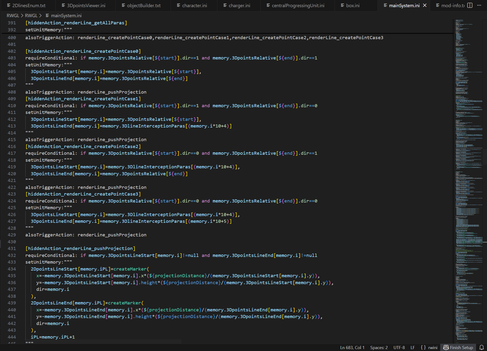

# RWini_Plugin

--- RWini-Plugin ---  
Date: 2025/12/20

Current Version: 2.1.3

Contributor: M507,ZeroDegress,NDT,hxyy

Description:  
This is a VSCode plugin for editing a specific code for Rusted Warfare 1.15 Modding.  

Supported Features:  
- Syntax Highlight;  
- Semantic Highlight(Variables like 'memory.x','resource.x');  
- Auto-completing for sections, keys, most values;  
- Diagnostics for sections, keys, some constant values;  
- Section folding and multiline folding;  
- Hover Prompts (Accepted value type, Chinese translations and descriptions for keys);
- File Path Jump;

简介:

用于辅助编写铁锈战争1.15模组的ini代码的插件. 

反馈该插件的Bug或交流RWini代码技术可以加入qq群212098363.

目前支持功能:
- 语法高亮;
- 语义高亮(如memory与resource变量);
- 自动补全. 支持节,键,大部分值;
- 简单语法诊断. 支持节,键,静态值;
- 节折叠与多行折叠;
- 悬停提示 (键的值类型, 中文翻译和解释);
- 文件路径点击跳转.

高亮预览图如下(使用了我的RWGL项目展示):

Update Log:  
   2.1.0 (2024.5.14):  
   - Auto-completing for more keys and parameters;  
   - Improvements in hover promots for logic values;  
   - Fix bugs;  

   2.1.1 (2025.12.19):  
   - Upload to Marketplace;
   - Fix bugs;  

   2.1.2 (2025.12.20)
   - Improved recognition of memorys;
   - Fix bugs;

   2.1.3 (2025.12.20)
   - Improved README

